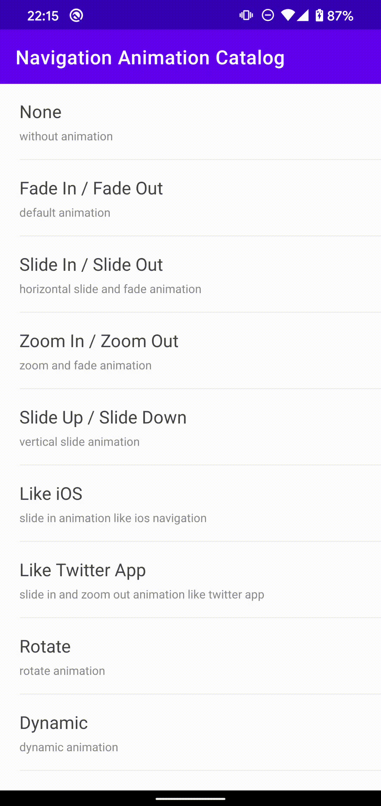

# Android UI Catalog of animation using navigation components
There are some nice looking transition animation animation samples that use [Navigation Component](https://developer.android.com/guide/navigation/navigation-getting-started).

## Samples overview
None|Fade In / Fade Out|Slide In / Slide Out
:--:|:--:|:--:
||

Zoom In / Zoom Out|Slide Up / Slide Down|Like iOS
:--:|:--:|:--:
||

Like Twitter App|Rotate|Dynamic
:--:|:--:|:--:
||

## Note
* This uses navigation [2.3.0](https://developer.android.com/jetpack/androidx/releases/navigation#version_230_3).
* Use [FragmentContainerView](https://developer.android.com/reference/androidx/fragment/app/FragmentContainerView) instead of FrameLayout.
* Notice that the background color of the activity changes.

## Libraries
* [kotlin](https://kotlinlang.org/)
* [androidx](https://developer.android.com/jetpack/androidx)
  * [appcompat](https://developer.android.com/jetpack/androidx/releases/appcompat)
  * [android ktx](https://developer.android.com/kotlin/ktx)
  * [navigation](https://developer.android.com/guide/navigation/navigation-getting-started)
* [material-components](https://github.com/material-components/material-components-android)
